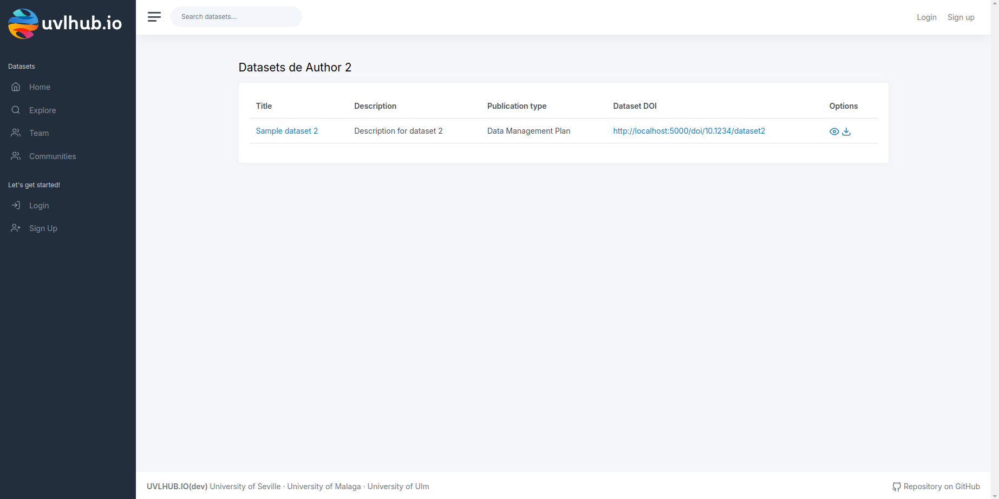

  

# RaboDeToro-hub-1

Aplicación de modelos formmato UVL integrada con fakenodo y flamapy siguiendo los Principios de Ciencia Abierta, que permite a los usuarios acceder a conjuntos de datos publicos con buscadores de alta calidad y con comunidades para poder buscar los datos del tipo que mas le interesen - Desarrollado por EGC2425-RaboDeToro-Hub-1.

## Miembros del proyecto

| Miembro |
| ------------- |
| [Mesa Pérez, Virginia](https://github.com/virmesper)|
| [Moreno Moguel, Juan Antonio](https://github.com/JuanAntonioMorenoMoguel)|
| [Morgado Prudencio, Jose María](https://github.com/josemorgado)|
| [Reyes Apresa, Mario](https://github.com/marioreyesapresa)|
| [Sanchez Gómez, Paula](https://github.com/paulasanchezg)|
| [Suarez Linares, Paula María](https://github.com/pausualin)|

## Objetivos del proyecto

A lo largo de este proyecto se han realizado diversas integraciones a la aplicacion que le aportan mayor valor y mayor usabilidad y accesibilidad, ademas, se han desarrollado tecnicas y procesos que facilitan la agregacion de cambios al proyecto y a la gestion del mismo.

Algunas de las nuevas integraciones son los "Work Items":

### WI realizados:

- **Improve Search:** (Medium) Consiste en añadir nuevos filtros a la sección de explore en uvlhub. Los filtros añadidos han sido de rango de fecha y de tamaño de datasets. 

  

- **View user profile:** (Low)Este WorkItem nos permite visualizar los datasets subidos por un usuario al pinchar sobre su nombre. Esto permite una mayor navegabilidad sobre la página.

  

- **Remember my password:** (Low) Permite a los usuarios recuperar y cambiar su contraseña en caso de que la hayan olvidado a través de un correo electrónico que se envia.

  

- **Download All Datasets:** (Medium) Nos permite descargar todos los datasets con todos los modelos y en todos los formatos al pulsar un botón.

  

- **Advanced filtering:** (High) ESte es un filtro avanzado que nos permite filtrar por número de características y número de productos para obtener datasets deacuerdo a mis necesidades.

  

- **Create Communities:** (High) Permite crear una comunidad que dara mejor accesibilidad a los usuarios que esten dentro de la comunidad, permitiendoles acceder rapidamente a los datasets de los otros usuarios de la comunidad.

  

- **Fakenodo:** Redirigimos las llamadas a zenodo a fakenodo para evitar sobresaturar la red.

### Enlaces de despliegue del proyecto:
- **Render:**  [ https://rabodetoro-hub-1.onrender.com](https://rabodetoro-hub-1.onrender.com)
- **Wiki:** [https://github.com/EGC2425-RaboDeToro-hub/RaboDeToro-hub-1/wiki](https://github.com/EGC2425-RaboDeToro-hub/RaboDeToro-hub-1/wiki)
